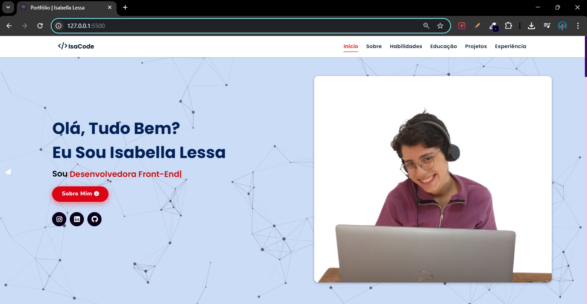
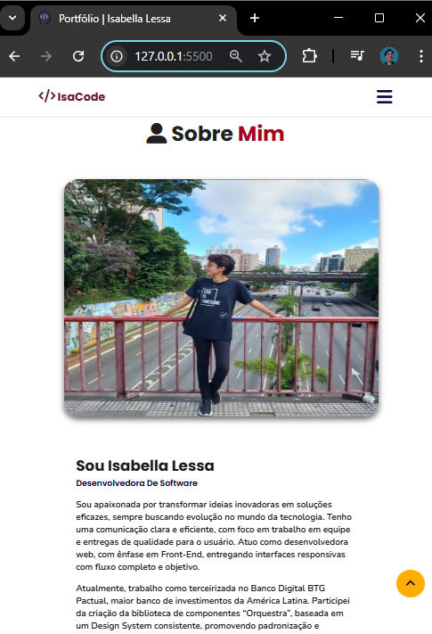
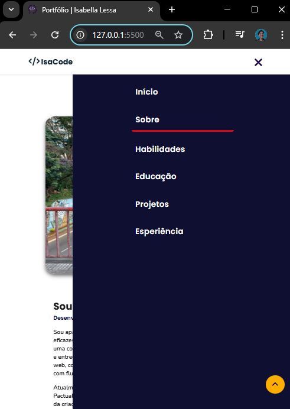

# 🌐 Portfólio Pessoal - Isabella Lessa

Este é o repositório do meu portfólio pessoal, desenvolvido com HTML, CSS e JavaScript. O objetivo é apresentar minhas habilidades, experiências e projetos, além de oferecer um meio de contato direto.

## 📌 Visão Geral

O site é composto por cinco seções principais:

- **Home**: Apresentação inicial com efeito de partículas animadas.
- **Sobre**: Breve descrição pessoal.
- **Habilidades**: Lista de competências técnicas.
- **Projetos**: Galeria com projetos realizados.
- **Contato**: Formulário para envio de mensagens por e-mail.

## 🛠️ Tecnologias Utilizadas

- **HTML5** - Estrutura do site
- **CSS3** - Estilização, com foco em responsividade e design moderno
- **JavaScript** - Validação do formulário e interatividade
- **Particles.js** - Efeitos visuais com partículas animadas no fundo
- **FormSubmit** - Serviço externo para envio de mensagens por e-mail

## 📁 Estrutura de Pastas

```
├── /assets
│   |── /css
|   |     └── index.css
|   |── /docs
|   |    └── Currículo - Isabella Lessa 2025.pdf
|   |── /images
│   |     └── (imagens utilizadas no site divididas em subcategorias)
|   |── /js
│         └── (configurações do Particles.js, FormSubmit e funcionalidades de contato por e-mail)
├── index.html
├── README.md
```

## Desktop



## Mobile





## 🚀 Como Visualizar

Você pode:

1. Clonar o repositório:
   ```bash
   git clone https://github.com/Isabella-Lessa/Portfolio.git
   cd Portfolio
   ```
2. Abrir o arquivo `index.html` no navegador.

## 🌐 Site no ar

Este portfólio está hospedado via **GitHub Pages** e pode ser acessado aqui:  
🔗 [https://isabella-lessa.github.io/Portfolio/](https://isabella-lessa.github.io/Portfolio/)

## 📬 Contato

Para dúvidas, colaborações ou propostas:

- Email: isabella.lessa27@gmail.com

---

Feito com 💙 por Isabella Lessa.
